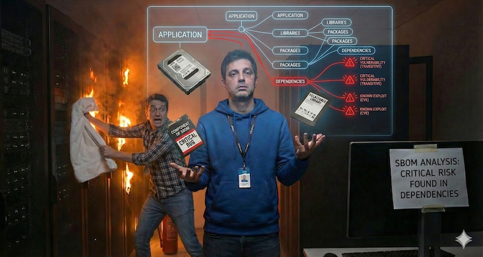

# Software Bill of Materials (SBOM): Analysing Transitive Dependencies and Supply Chain Lineage

This notebook demonstrates how to perform **Software Bill of Materials (SBOM) Analysis**, building and extending on the [Vulnerability Prioritization and Exposure Management (VPEM)](https://github.com/pedroleitao-neo4j/cyber-vpem) use case graph in Neo4j. By mapping the recursive relationships between software libraries, build artifacts, and running applications, organizations can achieve full **Code-to-Cloud traceability**.

This is a critical extension of standard vulnerability management, shifting the focus from top-level dependencies to the **hidden risks** buried deep within the software supply chain.

The SBOM graph highlights all artefacts that depend on potentially risky libraries or components, even if those dependencies are several layers deep. This enables security teams to identify and remediate vulnerabilities that traditional SBOM tools may overlook.

This example includes two main notebooks:

1. **[Data Ingestion](loader.ipynb)**: Loads additional transitive dependency data into the existing VPEM graph, simulating a multi-tier software lineage.
2. **[SBOM Analysis](sbom.ipynb)**: Demonstrates Cypher queries to identify vulnerabilities in deep dependencies and maps them to internet-facing 
production infrastructure.

### What is a Software Bill of Materials (SBOM) and Why Does It Matter?

Think of a modern software application like a complex pre-packaged meal from a grocery store. The label on the back lists the ingredients—this is essentially what an **SBOM** is for software. It is a comprehensive, nested list of every "ingredient" (code library or component) used to build an application.

In the digital world, developers rarely write every line of code from scratch; they use existing libraries to handle common tasks. These libraries often use *other* libraries, creating a deep and often invisible chain of dependencies.

**SBOM Analysis** is critical because it provides clarity on:

* **The "Hidden" Ingredients:** It reveals "transitive dependencies"—the components your software uses indirectly that you might not even know are there.
* **Zero-Day Resilience:** When a new security flaw is discovered in a common library, an SBOM allows you to instantly see if any of your applications are affected, rather than spending weeks searching through codebases.
* **Code-to-Cloud Visibility:** It bridges the gap between the development team (who builds the code) and the operations team (who runs it), showing exactly which production servers are running potentially risky "ingredients".

By maintaining a clear, graph-based SBOM, organizations move from guessing their risk to having total **Code-to-Cloud traceability**, ensuring that when a problem is found, it can be isolated and fixed at the source immediately.

## Use Case Overview

The SBOM use case demonstrates how to:

* **Identify Transitive Risks:** Discover vulnerabilities in low-level libraries that are "hidden" several layers deep in the dependency chain.
* **Trace Code Lineage:** Map the path from a poisoned third-party library through shared internal utilities to final business applications.
* **Visualize Deployment Exposure:** Correlate vulnerable code with infrastructure data to see which internet-facing servers are running "at-risk" artifacts.

## Data Sources

To perform a comprehensive supply chain analysis, we integrate the following data layers:

1. **Vulnerability & Threat Intel:** CVE data from **NVD** and exploitation status from **CISA KEV**.
2. **Software Lineage:** Synthetic data representing the recursive `DEPENDENCY_OF` relationships between libraries and build artifacts.
3. **Application & Infrastructure:** Relationships between build artifacts, applications, and the **ComputeInstances** where they are deployed.

## The Graph Advantage

Traditional SBOM tools often rely on flat lists that miss the recursive nature of modern software. Neo4j unifies these layers to perform **Transitive Dependency Traversal**:

* **Hidden Dependency Mapping:** Visualizing how a critical CVE in a small utility library propagates risk to dozens of top-level applications.
* **Zero-Day Impact Analysis:** Instantly identifying every server in your environment affected by a newly discovered vulnerability in the software stack.
* **Remediation Efficiency:** Finding "chokepoint" libraries—shared internal components that, if updated, resolve the highest number of reachable risks.

## The Resulting Schema

The extended Cyber SBOM graph utilizes the existing VPEM model. It leverages the recursive nature of the `DEPENDENCY_OF` relationship between `Library` nodes to model complex software supply chains without requiring schema changes.

## Architecture

### Overview

The system utilizes a **Security Knowledge Graph** to map complex software lineages in real-time. This architecture excels at identifying transitive relationships that flat databases struggle to represent, such as a vulnerability hidden 4 levels deep in a Java package.

### Typical Data Flow

1. **Ingestion:** Loading CVE/KEV data and software manifest metadata into Neo4j.
2. **Lineage Simulation:** Injecting recursive `DEPENDENCY_OF` relationships to simulate shared internal utilities and third-party code.
3. **Exploration:** Running Cypher queries to trace paths from a `CVE` through the `Library` chain to an `Application`.
4. **Visualization:** Converting dependency results into readable "Lineage" diagrams using `networkx`.

## Outward System Integration

The insights generated from SBOM Analysis are pushed to:

* **DevSecOps (CI/CD):** To automatically fail builds if a new deployment introduces a known critical transitive vulnerability.
* **Security Operations (SOAR):** To prioritize patching based on whether a vulnerable library is actually deployed on an internet-facing host.
* **Compliance & Auditing:** To provide "Full Lineage" reports for regulatory requirements such as Executive Order 14028.
