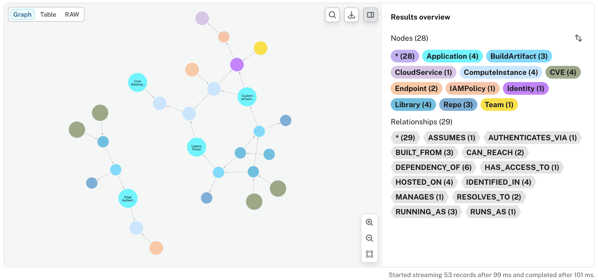

# SBOM Analysis
## Transitive Dependencies & Supply Chain Lineage
### Cybersecurity Use Cases: Full Code-to-Cloud Traceability with Neo4j
*Based on: [pedroleitao-neo4j/cyber-sbom](https://github.com/pedroleitao-neo4j/cyber-sbom)*

---

# What is an SBOM?
### The "Pre-packaged Meal" Analogy
Think of an application as a pre-packaged meal:
- The **label** lists the ingredients (libraries/components).
- Developers don't write everything from scratch; they use libraries.
- Those libraries use *other* libraries, creating a **hidden chain**.

**The Goal:** Move from guessing risk to total traceability.

---

# The Problem: Hidden Ingredients
### Traditional tools focus on top-level dependencies, missing **Transitive Risks**.

- **Invisible Chains:** Risks buried 4-5 layers deep in the software lineage.
- **Zero-Day Lag:** Finding affected apps manually can take weeks.
- **The Gap:** Disconnect between Development (code) and Operations (cloud servers).

---

# The Solution: Cyber-SBOM Graph
### Building on the **VPEM** (Vulnerability Prioritization) model, this solution provides:

1. **Transitive Traversal:** Navigating recursive `DEPENDENCY_OF` relationships.
2. **Zero-Day Resilience:** Instant impact analysis for new CVEs.
3. **Code-to-Cloud Visibility:** Linking vulnerable code directly to the **ComputeInstances** where it is running.

---

# Core Project Architecture

### 1. Data Ingestion (`loader.ipynb`)
- Loads transitive dependency data into the VPEM graph.
- Simulates multi-tier software lineage.

### 2. SBOM Analysis (`sbom.ipynb`)
- Identifies vulnerabilities in deep dependencies.
- Maps risk to internet-facing production infrastructure.

---

# Analysing the Blast Radius
### The Application View Graph

- **Traceability:** Map the path from a poisoned 3rd-party library to a business app.
- **Exposure:** Correlate vulnerable code with infrastructure data.
- **Real-time:** See which internet-facing servers are running "at-risk" artifacts.

---

# An Example Blast Radius Graph

---

# The Resulting Graph Schema
### The model uses a **Security Knowledge Graph** to map three distinct layers:

- **Layer 1: Threat Intel** (CVE, NVD, CISA KEV).
- **Layer 2: Software Lineage** (Recursive `DEPENDENCY_OF` relationships).
- **Layer 3: Infrastructure** (Build artifacts $\rightarrow$ Applications $\rightarrow$ ComputeInstances).

---

# The Graph Advantage: Impact Analysis
### Unlike flat lists, Neo4j allows for **Transitive Dependency Traversal**:

- **Impact Analysis:** Instantly find every server affected by a new vulnerability.
- **Chokepoint Discovery:** Find internal shared components that, if patched, resolve the highest number of reachable risks.
- **Remediation Efficiency:** Prioritize by "reachability" and "exposure."

---

# System Integration & Output
### The insights from this analysis flow into:
- **DevSecOps (CI/CD):** Automatically fail builds that introduce critical transitive risks.
- **Security Operations (SOAR):** Prioritize patching for internet-facing hosts.
- **Compliance:** Generate "Full Lineage" reports for regulatory requirements (e.g., Executive Order 14028).

---

# Questions?
**GitHub:** [pedroleitao-neo4j/cyber-sbom](https://github.com/pedroleitao-neo4j/cyber-sbom)
**Reference:** VPEM (Vulnerability Prioritization and Exposure Management)